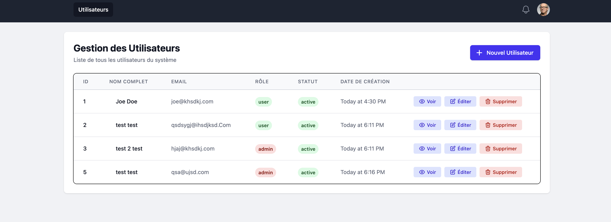
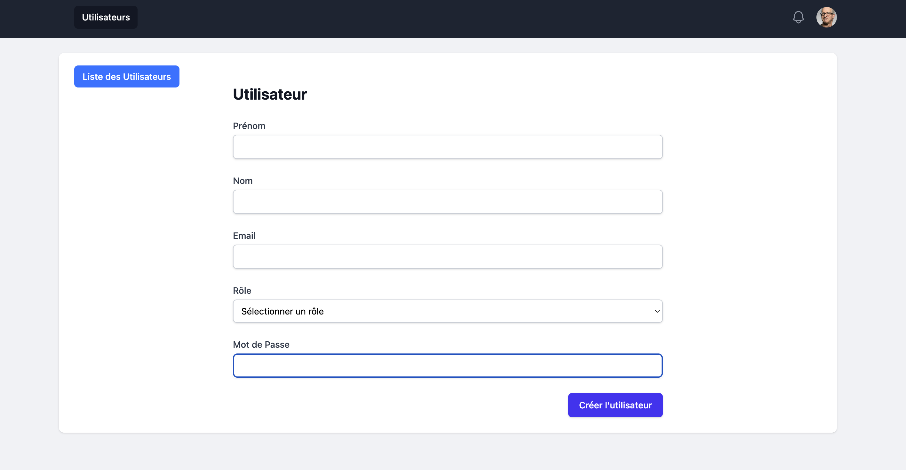

# User Manager - User Management Application

User management application developed with **IGO.js**, following MVC architecture and using MySQL as database.

## 🚀 Features

- ✅ **Complete CRUD** : Create, read, update and delete users
- ✅ **Validation** : Server-side validation with IGO Forms
- ✅ **Modern Interface** : Responsive design with Tailwind CSS
- ✅ **MVC Architecture** : Following IGO.js principles
- ✅ **Integrated ORM** : Using IGO ORM for MySQL

## 📸 Screenshots

### User Management Dashboard


_Complete user management interface with list view, role badges, and action buttons_

### User Creation Form


_form for creating, editing and view users_

## 📋 Prerequisites

- Node.js (version 14+)
- Docker and Docker Compose
- MySQL 8.0

## 🛠️ Installation

### 1. Clone the project

```bash
git clone <repository-url>
```

### 2. Install dependencies

```bash
npm install
```

### 3. Environment configuration

Create a `.env` file at the project root:

```env
# Database Configuration
DB_HOST=localhost
DB_PORT=3306
DB_USERNAME=root
DB_PASSWORD=password
DB_DATABASE=user_manager

# Application Configuration
NODE_ENV=dev
```

### 4. Start services

#### Recommended Architecture (Development)

```bash
# 1. Start services (MySQL + Redis)
docker-compose up -d

# 2. Initialize the database
npm run init-db

# 3. Launch the application
npm start
```

### 5. Start the application

```bash
npm start
```

The application will be accessible at: http://localhost:3000

## 🗄️ Database Structure

### `users` table

```sql
CREATE TABLE IF NOT EXISTS users (
    id INT AUTO_INCREMENT PRIMARY KEY,
    email VARCHAR(255) NOT NULL,
    first_name VARCHAR(255) NOT NULL,
    last_name VARCHAR(255) NOT NULL,
    password VARCHAR(255) NOT NULL,
    role VARCHAR(100) NOT NULL,
    status VARCHAR(100) NOT NULL,
    created_at DATETIME NOT NULL DEFAULT CURRENT_TIMESTAMP
) ENGINE=InnoDB DEFAULT CHARSET=utf8mb4 COLLATE=utf8mb4_unicode_ci;
```

## 📁 Project Architecture

```
user-manager/
├── app/
│   ├── controllers/          # MVC Controllers
│   │   ├── UserController.js
│   │   └── WelcomeController.js
│   ├── models/               # Models and validation
│   │   ├── userModel.js
│   │   ├── CreateUserForm.js
│   │   └── UpdateUserForm.js
│   ├── services/             # Business logic
│   │   └── user/
│   │       └── user.service.js
│   ├── routes.js             # Route definitions
│   ├── helpers.js            # Dust helpers
│   └── config.js             # Configuration
├── views/                    # Dust templates
│   ├── layouts/
│   │   ├── main.dust
│   │   └── _header.dust
│   └── user/
│       ├── list.dust
│       └── edit.dust
├── sql/                      # SQL scripts
│   └── 20250101-1.sql
├── js/                       # Initialization scripts
│   └── init-databse.js
├── docker-compose.yml        # Docker configuration
└── package.json
```

## 🎯 Available Routes

| Method | Route             | Description           |
| ------ | ----------------- | --------------------- |
| GET    | `/`               | Home page - User list |
| GET    | `/users`          | User list             |
| GET    | `/users/new`      | Create user form      |
| GET    | `/users/:id`      | User details          |
| GET    | `/users/:id/edit` | Edit user form        |
| POST   | `/users/create`   | Create user           |
| POST   | `/users/:id/edit` | Update user           |
| POST   | `/users/:id`      | Delete user           |

## 🧪 Available Scripts

```bash
# Database
npm run init-db        # Initialize the database
```

## 🐳 Docker

### Available services :

- **MySQL 8.0** : Main database
- **Redis 7** : Cache (optional)

> **Note** : The Node.js application runs locally to avoid Redis network configuration issues (i get this issue so this was my solution in Docker) .

## 🔧 Technologies

- **Backend** : IGO.js (Node.js Framework)
- **Database** : MySQL 8.0
- **Versioning** : Git
- **ORM** : Integrated IGO.js ORM
- **Templates** : Dust.js
- **Design** : Tailwind CSS
- **Containerization** : Docker

## 🚀 Deployment

To deploy in production :

1. Modify environment variables (if necessary)
2. Configure database
3. run `docker-compose up -d`
4. Init the database with `npm run init-db`
5. Start with `npm start`

## 📝 Detailed Analysis

- For a reponse to question in **Part 1**, see the [SOLUTION.md](./A&Q/SOLUTION.md)

- For a complete analysis of the exercise, see the [ANALYSE.md](./A&Q/ANALYSE.md) file which contains :

  - Difficulties encountered
  - Pleasant surprises
  - Development approach
  - Identified improvement points
  - Conclusion and recommendations

## 📄 License

Project developed as part of a technical test.
